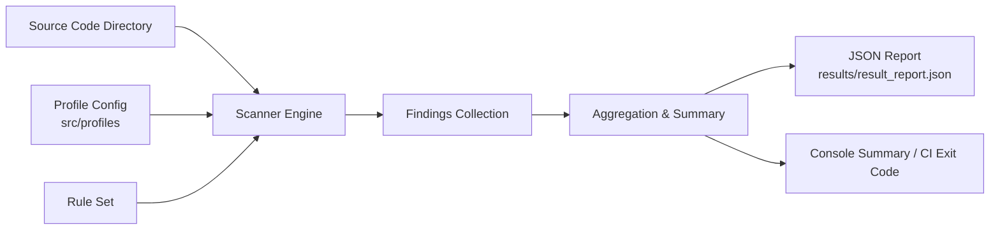

## Adaptive Secure Code Assistant

Adaptive Secure Code Assistant is a lightweight, extensible static analysis tool that scans source code for common security vulnerabilities (e.g., SQL injection, hard‑coded secrets) and produces structured, machine‑readable findings. It is designed to be integrated into local development workflows, IDEs, and CI/CD pipelines so security issues can be caught and fixed early.

The project is organized around three core ideas:
- **Adaptive analysis**: scanning behaviour can be tuned using profiles (e.g., stricter for production, more permissive for experiments).
- **Rule‑driven detection**: security checks are encoded as reusable, composable rules.
- **Actionable results**: outputs are structured (JSON) and optimized to be consumed by other tools or assistants.

---

## 1. Project Description

### 1.1 Problem Statement
Modern teams write and review large volumes of code under time pressure. Manual reviews miss subtle security flaws such as:
- **SQL injection** via unsafe query string concatenation.
- **Hard‑coded secrets** (API keys, tokens, passwords).
- **Unsafe patterns** that are obvious to security experts but easy to overlook during normal code review.

Security scanners exist, but they are often:
- Hard to configure and integrate with custom tooling.
- Not tuned to the team’s actual risk profile.
- Opaque in how they reach conclusions, making developer adoption difficult.

### 1.2 Solution Overview
Adaptive Secure Code Assistant provides:
- **Local, scriptable static analysis**: scan your project from the command line or from other tools.
- **Pluggable rules**: new checks can be added without rewriting the scanner.
- **Profiles**: pre‑defined and custom profiles allow different rule sets or strictness levels for different environments.
- **Structured outputs**: JSON reports make it easy to post‑process results or feed them into other systems (e.g., dashboards, AI assistants).

The example `results/result_report.json` illustrates a typical scan result where the tool detected:
- Multiple **SQL injection** issues in a test Python file.
- One **hard‑coded secret** flagged as an `API_KEY` with an entropy score.

---

## 2. Inputs and Outcomes

### 2.1 Inputs
- **Source code directory**: path to the repository or subdirectory to scan.
- **Scan profile (optional)**:
  - Defines which rules are enabled.
  - May control thresholds (e.g., minimum entropy score for secret detection).
- **Configuration options (optional)**, such as:
  - File inclusion/exclusion patterns.
  - Output path for reports (e.g., `results/result_report.json`).
  - Log verbosity.

> The exact CLI / API surface depends on how you wire the scanner into your environment, but the conceptual inputs above remain the same.

### 2.2 Outcomes
- **Primary outcome**: a JSON report describing all detected vulnerabilities in the scanned codebase. Example (from `results/result_report.json`):

```json
{
  "scan_timestamp": "2025-11-22T03:52:45.467967Z",
  "total_vulnerabilities": 4,
  "vulnerabilities": [
    {
      "file": "C:\\\\Users\\\\abrar\\\\Music\\\\AdaptiveSecureCodeAssistant\\\\test_example.py",
      "line_no": 10,
      "snippet": "cursor.execute(\"SELECT * FROM users WHERE id = \" + user_id)",
      "rule": "SQL_INJECTION",
      "reason": "String concatenation in SQL execute() call"
    },
    {
      "file": "C:\\\\Users\\\\abrar\\\\Music\\\\AdaptiveSecureCodeAssistant\\\\test_example.py",
      "line_no": 22,
      "snippet": "stripe_api_key <removed-for-security>",
      "rule": "HARDCODED_SECRET",
      "secret_type": "API_KEY",
      "entropy_score": 4.82
    }
  ],
  "summary": {
    "SQL_INJECTION": 3,
    "HARDCODED_SECRET": 1
  }
}
```

- **Secondary outcomes**:
  - Console summary (e.g., counts of findings by type).
  - Exit code suitable for CI (e.g., non‑zero if issues above a threshold are detected).

---

## 3. End‑to‑End Technical Description

> This section describes the intended technical design of the Adaptive Secure Code Assistant based on the current project structure (`src/profiles`, `src/scanner`, `src/utils`) and example output.

### 3.1 High‑Level Flow
1. **Initialization**
   - Load configuration and selected profile (default or user‑specified).
   - Instantiate rule set(s) enabled by the profile.
2. **Discovery**
   - Walk the input directory recursively.
   - Filter files based on supported languages and configured include/exclude patterns.
3. **Scanning**
   - For each file:
     - Optionally build a language‑specific representation (e.g., token stream or AST).
     - Apply relevant rules (SQL injection rules for DB access code, secret detection rules for strings, etc.).
   - Accumulate findings (each finding includes file path, line number, snippet, rule ID, and explanatory reason).
4. **Aggregation**
   - Summarize findings by rule type.
   - Attach metadata such as scan timestamp and counts.
5. **Reporting**
   - Serialize the aggregated results to JSON.
   - Optionally print a human‑readable summary to stdout.
   - Return an appropriate process exit code for CI integration.

### 3.2 Core Components

- **Profiles (`src/profiles/`)**
  - Encapsulate different **security postures** or **environments**:
    - Example: `default`, `strict`, `experimental`.
  - Define:
    - Which rules are active.
    - Severity mappings (e.g., treat `HARDCODED_SECRET` as "high" in production, "medium" in dev).
    - Optional per‑rule configuration (e.g., entropy thresholds, file patterns).

- **Scanner (`src/scanner/`)**
  - Implements the main scanning logic:
    - Directory traversal.
    - File type detection.
    - For each file, applies the active rules.
  - Collects raw findings into an in‑memory structure (e.g., list of vulnerability objects).

- **Utilities (`src/utils/`)**
  - Shared helper functions, such as:
    - Path normalization and file system utilities.
    - JSON serialization helpers.
    - Logging and timestamp generation.

---

## 4. Output Metrics

### 4.1 Core Metrics
The JSON report is structured to support both human inspection and automated metric extraction. Typical metrics include:
- **Total vulnerabilities**: `total_vulnerabilities` (e.g., `4`).
- **Findings by rule type** (from `summary`), e.g.:
  - `SQL_INJECTION`: `3`
  - `HARDCODED_SECRET`: `1`
- **Per‑file density**:
  - Number of findings per file (or per 1000 lines of code).

### 4.2 Operational Metrics (Recommended)
You can extend the reporting layer to expose additional metrics such as:
- **Scan time**:
  - Total wall‑clock time and per‑file averages.
- **Coverage**:
  - Number of files and lines scanned vs. skipped.
- **Trend metrics** (used externally):
  - Track `total_vulnerabilities` and each rule category over time to measure improvement or regression in code security posture.

---

## 5. Architecture Diagram

Below is a conceptual architecture diagram showing how the main components interact.



Key relationships:
- The **Scanner Engine** is driven by **Profiles** and **Rule Sets**.
- Results are funneled into a unified **Findings Collection**, then aggregated before being written as structured JSON.

---

## 6. Methodology

### 6.1 Static Analysis Approach
The assistant performs **static analysis** (no code execution). Methodologically, it relies on:
- **Pattern‑based rules**:
  - Example: detect calls to `cursor.execute(...)` where the SQL query is assembled via string concatenation or interpolation.
  - Example: detect high‑entropy string literals that look like API keys or tokens.
- **Context awareness** (where applicable):
  - Differentiate between harmless string concatenation and concatenation in an SQL execution context.
  - Use rule‑specific heuristics (e.g., entropy thresholds) to reduce noise for secret detection.

### 6.2 Rule Design Principles
- **Precision over recall (configurable)**:
  - Default profiles may prioritize fewer false positives.
  - Strict profiles can flip that, flagging any suspicious usage.
- **Explainability**:
  - Each finding includes a `reason` explaining why the rule fired.
- **Extensibility**:
  - New rules can be added without changing the scanner’s core orchestration logic.

---

## 7. Phase‑Wise Implementation Overview

This section outlines a typical phased implementation roadmap for the Adaptive Secure Code Assistant.

### Phase 1 – Core Scanner and JSON Reporting
- **Goals**:
  - Implement directory traversal and basic file scanning.
  - Build a minimal rule engine capable of:
    - Detecting simple SQL injection via string concatenation.
    - Detecting hard‑coded secrets via pattern and entropy checks.
  - Output results to a structured JSON file (e.g., `results/result_report.json`).
- **Deliverables**:
  - Initial scanner component.
  - Basic rule set (`SQL_INJECTION`, `HARDCODED_SECRET`).
  - JSON schema for reports.

### Phase 2 – Profiles and Configuration
- **Goals**:
  - Introduce profile management in `src/profiles`.
  - Allow enabling/disabling rules per profile.
  - Add configuration options (e.g., include/exclude patterns, thresholds).
- **Deliverables**:
  - Default and at least one stricter profile.
  - Config loader and validator.

### Phase 3 – Advanced Rules and Language Support
- **Goals**:
  - Expand rule coverage (e.g., additional injection types, insecure crypto usage).
  - Add or improve language‑specific logic where needed.
  - Improve context sensitivity for existing rules to reduce false positives.
- **Deliverables**:
  - Extended rule library.
  - Per‑language scanning adapters (where relevant).

### Phase 4 – Integration and Feedback Loop
- **Goals**:
  - Provide CLI or API integration for CI/CD and editor/assistant workflows.
  - Capture metrics (e.g., findings over time, false‑positive rates) through external tooling.
  - Iterate on rules and profiles based on real‑world feedback.
- **Deliverables**:
  - CLI wrapper or integration scripts.
  - Documentation for CI usage (e.g., how to fail the pipeline based on thresholds).

---

## 8. Usage Examples (Conceptual)

The exact commands depend on how you wire the scanner, but conceptually a scan looks like:

```bash
# Scan the current project with the default profile
python -m src.scanner --path . --output results/result_report.json

# Scan a specific directory with a strict profile
python -m src.scanner --path ./my_service --profile strict --output results/result_report.json
```

You can then consume the JSON output directly or feed it into dashboards, reporting tools, or AI‑based assistants that help explain and remediate each finding.

---

## 9. Limitations and Future Work

- **Static analysis only**:
  - No runtime execution; some issues require dynamic analysis or fuzzing to confirm.
- **Language coverage**:
  - Initial focus may be on a subset of languages (e.g., Python); additional languages can be added over time.
- **False positives / negatives**:
  - Complex data flows and framework‑specific behaviours are hard to model perfectly with lightweight static rules. Continuous tuning is expected.

Planned improvements can include:
- Tighter integration with IDEs and AI assistants for inline suggestions and auto‑remediation hints.
- Richer rule configuration (severity levels, custom tagging).
- Integration with secret scanners and dependency vulnerability databases.

---

## 10. Contributing and Extending

- **Extending rules**:
  - Add or modify rules in the rule engine to support new vulnerability types.
  - Update profiles to enable new rules by default where appropriate.
- **Improving reporting**:
  - Add additional metrics or formats (e.g., SARIF) to integrate with more security tools.

Please adapt the file paths, CLI invocation, and configuration details as you evolve the underlying implementation of the Adaptive Secure Code Assistant.
